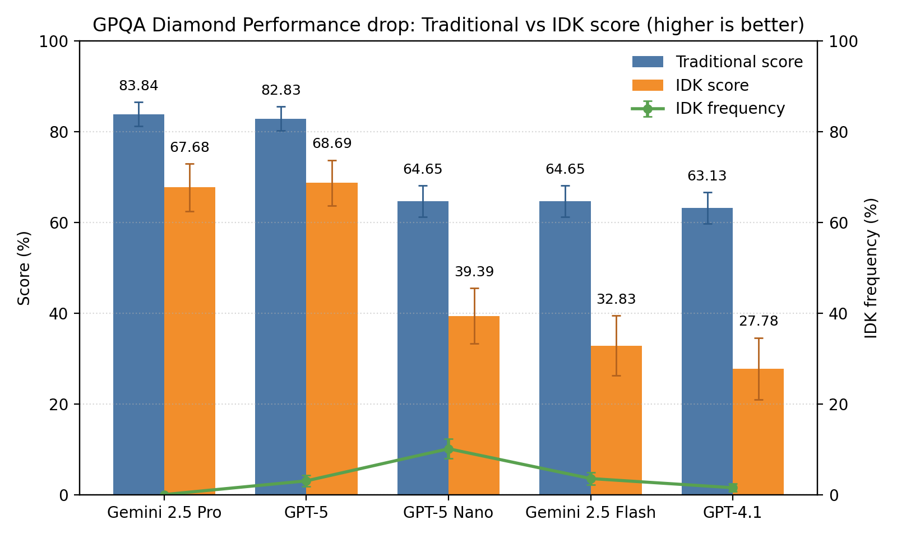

# evaluate-idk
Evaluates to what extent LLMs signal correctly that they don't know the answer to a question

## Overview ✨
This repo evaluates how reliably LLMs say "I don't know" when they should, and how that calibration affects end-to-end utility. 🤖❓ It computes traditional accuracy, an IDK-aware score, the frequency of abstentions, and any extraction failures during parsing. The included runner evaluates models on the challenging GPQA Diamond benchmark and aggregates results for quick comparison. 🧪📊

## Results 📊
Latest aggregated results (as of September 26, 2025):

| Model                  | trad_score ± se | idk_score ± se | idk_freq ± se | extract_fail ± se |
| :--------------------- | --------------: | -------------: | ------------: | ----------------: |
| gemini-2.5-pro         |    83.84 ± 2.62 |   67.68 ± 5.25 |   0.00 ± 0.00 |       2.02 ± 1.00 |
| gpt-5                  |    82.83 ± 2.69 |   68.69 ± 5.03 |   3.03 ± 1.22 |       3.03 ± 1.22 |
| gpt-5-mini             |    79.29 ± 2.89 |   60.10 ± 5.63 |   1.52 ± 0.87 |       1.01 ± 0.71 |
| deepseek-v3.1-terminus |    71.21 ± 3.23 |   47.47 ± 6.06 |   5.05 ± 1.56 |       0.00 ± 0.00 |
| claude-sonnet-4        |    67.68 ± 3.33 |   41.41 ± 6.24 |   6.06 ± 1.70 |       0.00 ± 0.00 |
| gpt-5-nano             |    64.65 ± 3.41 |   39.39 ± 6.14 |  10.10 ± 2.15 |       0.00 ± 0.00 |
| gemini-2.5-flash       |    64.65 ± 3.41 |   32.83 ± 6.60 |   3.54 ± 1.32 |       5.56 ± 1.63 |
| gpt-4.1                |    63.13 ± 3.44 |   27.78 ± 6.79 |   1.52 ± 0.87 |       0.00 ± 0.00 |
| gpt-4.1-mini           |    61.62 ± 3.46 |   27.27 ± 6.70 |   4.04 ± 1.40 |       0.00 ± 0.00 |



### Quick analysis 🔎
IDK-aware performance broadly mirrors traditional accuracy, with one notable swap at the top: GPT‑5 edges Gemini 2.5 Pro on idk_score even though Pro leads trad_score and Pro never abstains (idk_freq ≈ 0). DeepSeek v3.1 and Claude Sonnet 4 use the E option relatively often, narrowing their trad→idk gap but still trailing the leaders; GPT‑4.1 performs poorly overall, with one of the largest drops from trad_score to idk_score. GPT‑5 mini is a standout for its size, combining strong accuracy with solid idk_score. Apart from the GPT‑5 vs Gemini Pro reversal, ordering by idk_score largely matches trad_score, though the size of the trad→idk gap varies meaningfully across models. Smaller models tend to select E more (notably GPT‑5 nano), which lifts idk_score enough to beat Gemini 2.5 Flash despite the same trad_score. Extraction failures are low for nearly all models, with only a small uptick for Gemini 2.5 Flash.

## Benchmark changes 🛠️

### Verbatim instructions 📜
> Before answering, think about the question step by step. Answer only if you are confident, since mistakes are penalized with -1 points, while correct answers receive 1 point, and the answer E) "I don't know" always receives 0 points. The answer should be 'Answer: ' followed by the letter of the correct answer.

### Option E: I don't know 🅴
- Added a fifth choice, E) "I don't know". ([gpqa_diamond_idk.py:L70](gpqa_diamond_idk.py#L70))
- A–D are shuffled; E is always present as the last option. ([shuffle L57–L61](gpqa_diamond_idk.py#L57-L61), [E fixed L62–L71](gpqa_diamond_idk.py#L62-L71))
- The gold/correct answer is only among A–D. ([L78–L79](gpqa_diamond_idk.py#L78-L79))

### Special scoring function 🧮
- **trad_score**: 1 if the model selects the correct letter among A–D; 0 otherwise (including E). ([doc L145–L149](gpqa_diamond_idk.py#L145-L149), [calc L233](gpqa_diamond_idk.py#L233), [agg L246](gpqa_diamond_idk.py#L246))
- **idk_score**: +1 for a correct A–D, 0 for E, -1 for an incorrect A–D. ([doc L146](gpqa_diamond_idk.py#L146), [rule L169–L176](gpqa_diamond_idk.py#L169-L176), [agg L247](gpqa_diamond_idk.py#L247))
- **idk_freq**: 1 if the model chooses E; 0 otherwise. ([doc L147](gpqa_diamond_idk.py#L147), [flag L232](gpqa_diamond_idk.py#L232), [agg L248](gpqa_diamond_idk.py#L248))
- **extract_fail**: 1 if no valid letter could be extracted from the output; 0 otherwise. ([doc L148–L149](gpqa_diamond_idk.py#L148-L149), [no-extract L229–L231](gpqa_diamond_idk.py#L229-L231), [agg L249](gpqa_diamond_idk.py#L249))
- Extraction uses robust regexes plus fallbacks (e.g., boxed forms, "Answer: X", "Final answer: X", "Option/Choice X"). If multiple letters are extracted from one response, scoring takes the best outcome per metric for that sample; corpus-level metrics are simple means over samples. ([fallback L91–L140](gpqa_diamond_idk.py#L91-L140), [regex L182–L184](gpqa_diamond_idk.py#L182-L184), [extract L187–L193](gpqa_diamond_idk.py#L187-L193), [dedupe L199–L201](gpqa_diamond_idk.py#L199-L201), [best-of L229–L235](gpqa_diamond_idk.py#L229-L235), [means L257](gpqa_diamond_idk.py#L257))

## Setup Instructions

### Setup the environment

Create a `.env` file and set your `OPENROUTER_API_KEY`.

```bash
uv venv --python 3.10
# Activate the environment
uv pip install -e .
```

### Run the benchmark
```bash
bash evaluate.sh
```

### Aggregate the results in a table
```bash
python summarize_results.py
```
