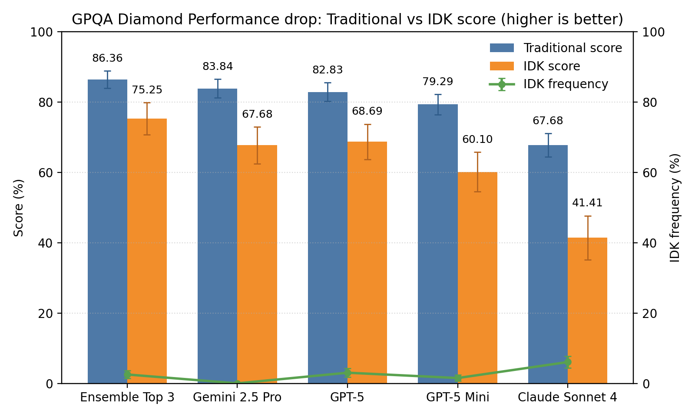
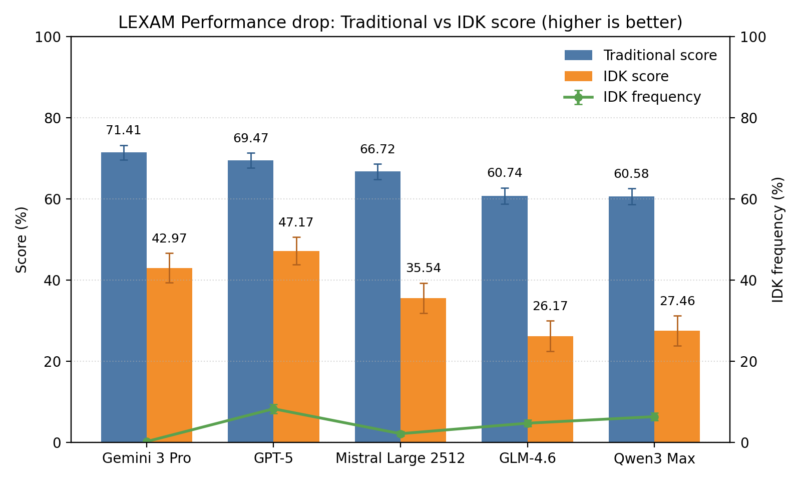

# evaluate-idk
Evaluates to what extent LLMs signal correctly that they don't know the answer to a question

## Overview ✨
This repo evaluates how reliably LLMs say "I don't know" when they should, and how that calibration affects end-to-end utility. 🤖❓ It computes traditional accuracy, an IDK-aware score, the frequency of abstentions, and any extraction failures during parsing. The included runner evaluates models on the challenging GPQA Diamond and LEXam English benchmarks and aggregates results for quick comparison. 🧪📊

So far, this repo supports GPQA-Diamond and LEXam-English.

## Results 📊

### GPQA-Diamond
Latest aggregated results (as of September 26, 2025):

| Model                  | trad_score ± se | idk_score ± se | idk_freq ± se | extract_fail ± se |
| :--------------------- | --------------: | -------------: | ------------: | ----------------: |
| gemini-2.5-pro         |    83.84 ± 2.62 |   67.68 ± 5.25 |   0.00 ± 0.00 |       2.02 ± 1.00 |
| gpt-5                  |    82.83 ± 2.69 |   68.69 ± 5.03 |   3.03 ± 1.22 |       3.03 ± 1.22 |
| gpt-5-mini             |    79.29 ± 2.89 |   60.10 ± 5.63 |   1.52 ± 0.87 |       1.01 ± 0.71 |
| deepseek-v3.1-terminus |    71.21 ± 3.23 |   47.47 ± 6.06 |   5.05 ± 1.56 |       0.00 ± 0.00 |
| minimax-m2:free        |    68.18 ± 3.32 |   39.39 ± 6.43 |   3.03 ± 1.22 |       3.54 ± 1.32 |
| claude-sonnet-4        |    67.68 ± 3.33 |   41.41 ± 6.24 |   6.06 ± 1.70 |       0.00 ± 0.00 |
| gemini-2.5-flash       |    64.65 ± 3.41 |   32.83 ± 6.60 |   3.54 ± 1.32 |       5.56 ± 1.63 |
| gpt-5-nano             |    64.65 ± 3.41 |   39.39 ± 6.14 |  10.10 ± 2.15 |       0.00 ± 0.00 |
| gpt-4.1                |    63.13 ± 3.44 |   27.78 ± 6.79 |   1.52 ± 0.87 |       0.00 ± 0.00 |
| gpt-4.1-mini           |    61.62 ± 3.46 |   27.27 ± 6.70 |   4.04 ± 1.40 |       0.00 ± 0.00 |



#### Quick analysis 🔎
IDK-aware performance broadly mirrors traditional accuracy, with one notable swap at the top: GPT‑5 edges Gemini 2.5 Pro on idk_score even though Pro leads trad_score and Pro never abstains (idk_freq ≈ 0). DeepSeek v3.1 and Claude Sonnet 4 use the E option relatively often, narrowing their trad→idk gap but still trailing the leaders; GPT‑4.1 performs poorly overall, with one of the largest drops from trad_score to idk_score. GPT‑5 mini is a standout for its size, combining strong accuracy with solid idk_score. Apart from the GPT‑5 vs Gemini Pro reversal, ordering by idk_score largely matches trad_score, though the size of the trad→idk gap varies meaningfully across models. Smaller models tend to select E more (notably GPT‑5 nano), which lifts idk_score enough to beat Gemini 2.5 Flash despite the same trad_score. Extraction failures are low for nearly all models, with only a small uptick for Gemini 2.5 Flash.

### LEXam-English
Latest aggregated results (as of October 9, 2025):

| Model                  | trad_score ± se | idk_score ± se | idk_freq ± se | extract_fail ± se |
| :--------------------- | --------------: | -------------: | ------------: | ----------------: |
| gpt-5                  |    69.47 ± 1.85 |   47.17 ± 3.35 |   8.24 ± 1.11 |       0.81 ± 0.36 |
| gemini-2.5-pro         |    66.72 ± 1.90 |   33.60 ± 3.79 |   0.16 ± 0.16 |       0.32 ± 0.23 |
| gpt-5-mini             |    66.56 ± 1.90 |   39.90 ± 3.54 |   6.79 ± 1.01 |       0.00 ± 0.00 |
| gemini-2.5-flash       |    66.24 ± 1.90 |   33.28 ± 3.78 |   0.81 ± 0.36 |       0.81 ± 0.36 |
| claude-sonnet-4.5      |    64.62 ± 1.92 |   35.70 ± 3.62 |   6.46 ± 0.99 |       0.32 ± 0.23 |
| grok-4-fast            |    61.23 ± 1.96 |   35.22 ± 3.48 |  12.76 ± 1.34 |       0.16 ± 0.16 |
| glm-4.6                |    60.74 ± 1.96 |   26.17 ± 3.78 |   4.68 ± 0.85 |       4.52 ± 0.84 |
| qwen3-max              |    60.58 ± 1.97 |   27.46 ± 3.73 |   6.30 ± 0.98 |       0.65 ± 0.32 |
| gpt-5-nano             |    56.54 ± 1.99 |   21.97 ± 3.74 |   8.89 ± 1.14 |       0.00 ± 0.00 |
| DeepSeek-V3.1-Terminus |    53.63 ± 2.01 |   24.88 ± 3.51 |  17.61 ± 1.53 |       0.00 ± 0.00 |
| minimax-m2:free        |    53.15 ± 2.01 |   21.16 ± 3.61 |  14.86 ± 1.43 |       2.26 ± 0.60 |



#### Quick analysis 🔎
LEXam proves considerably more challenging than GPQA Diamond, with all models showing lower absolute performance and dramatically larger trad→idk drops. GPT‑5 leads both trad_score (69.47%) and idk_score (47.17%), but even the top performer loses over 22 percentage points when accounting for incorrect answers. A striking pattern emerges with the Gemini models: both Pro (66.72% → 33.60%) and Flash (66.24% → 33.28%) virtually never abstain (idk_freq < 1%) and suffer identical ~33-point drops, suggesting systematic overconfidence across the Gemini family. Claude Sonnet 4.5 and GPT‑5 Mini fare better with moderate abstention rates (~6–7%), though their idk_scores still plummet to 35–40%. Models that abstain more liberally—notably DeepSeek v3.1 (17.61% idk_freq) and Grok 4 Fast (12.76%)—mitigate some damage but remain behind due to weaker baseline accuracy. Qwen3-max (60.58% trad, 6.30% idk_freq) sits in the mid-tier with moderate calibration. GPT‑5 Nano shows the widest trad→idk gap (34.57 points), suggesting poor calibration. Overall, LEXam's legal domain questions expose a critical weakness: most models confidently answer incorrectly far too often, and even selective abstention fails to salvage strong idk_scores.

## Benchmark changes 🛠️

### Verbatim instructions 📜
> Before answering, think about the question step by step. Answer only if you are confident, since mistakes are penalized with -1 points, while correct answers receive 1 point, and the answer E) "I don't know" always receives 0 points. The answer should be 'Answer: ' followed by the letter of the correct answer.

### Option E: I don't know 🅴
- Added a fifth choice, E) "I don't know".
- A–D are shuffled; E is always present as the last option.
- The gold/correct answer is only among A–D.

### Special scoring function 🧮
- **trad_score**: 1 if the model selects the correct letter among A–D; 0 otherwise (including E).
- **idk_score**: +1 for a correct A–D, 0 for E, -1 for an incorrect A–D.
- **idk_freq**: 1 if the model chooses E; 0 otherwise.
- **extract_fail**: 1 if no valid letter could be extracted from the output; 0 otherwise.
- Extraction uses robust regexes plus fallbacks (e.g., boxed forms, "Answer: X", "Final answer: X", "Option/Choice X"). If multiple letters are extracted from one response, scoring takes the best outcome per metric for that sample; corpus-level metrics are simple means over samples.

## Setup Instructions

### Setup the environment

Create a `.env` file and set your `OPENROUTER_API_KEY` and `HF_TOKEN`.

```bash
uv venv --python 3.10
# Activate the environment
uv pip install -e .
```

### Run the benchmark
```bash
bash evaluate.sh
```

### Aggregate the results in a table and create a bar plot
```bash
python summarize_results.py
```
