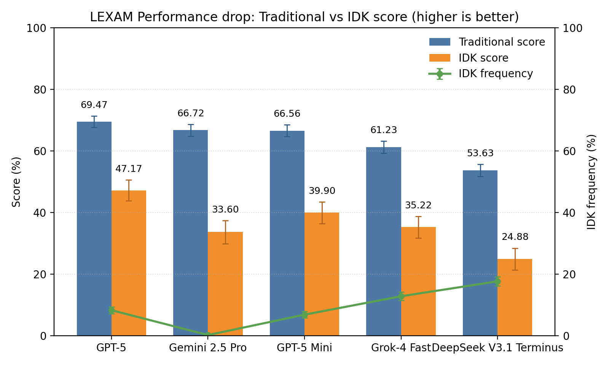

# evaluate-idk
Evaluates to what extent LLMs signal correctly that they don't know the answer to a question

## Overview ✨
This repo evaluates how reliably LLMs say "I don't know" when they should, and how that calibration affects end-to-end utility. 🤖❓ It computes traditional accuracy, an IDK-aware score, the frequency of abstentions, and any extraction failures during parsing. The included runner evaluates models on the challenging GPQA Diamond and LEXam English benchmarks and aggregates results for quick comparison. 🧪📊

So far, this repo supports GPQA-Diamond and LEXam-English.

## Results 📊

### GPQA-Diamond
Latest aggregated results (as of September 26, 2025):

| Model                  | trad_score ± se | idk_score ± se | idk_freq ± se | extract_fail ± se |
| :--------------------- | --------------: | -------------: | ------------: | ----------------: |
| ensemble-top3          |    86.36 ± 2.44 |   75.25 ± 4.54 |   2.53 ± 1.11 |       0.00 ± 0.00 |
| gemini-2.5-pro         |    83.84 ± 2.62 |   67.68 ± 5.25 |   0.00 ± 0.00 |       2.02 ± 1.00 |
| gpt-5                  |    82.83 ± 2.69 |   68.69 ± 5.03 |   3.03 ± 1.22 |       3.03 ± 1.22 |
| gpt-5-mini             |    79.29 ± 2.89 |   60.10 ± 5.63 |   1.52 ± 0.87 |       1.01 ± 0.71 |
| deepseek-v3.1-terminus |    71.21 ± 3.23 |   47.47 ± 6.06 |   5.05 ± 1.56 |       0.00 ± 0.00 |
| claude-sonnet-4        |    67.68 ± 3.33 |   41.41 ± 6.24 |   6.06 ± 1.70 |       0.00 ± 0.00 |
| gemini-2.5-flash       |    64.65 ± 3.41 |   32.83 ± 6.60 |   3.54 ± 1.32 |       5.56 ± 1.63 |
| gpt-5-nano             |    64.65 ± 3.41 |   39.39 ± 6.14 |  10.10 ± 2.15 |       0.00 ± 0.00 |
| ensemble-cheap         |    63.64 ± 3.42 |   36.87 ± 6.23 |   9.60 ± 2.09 |       0.00 ± 0.00 |
| gpt-4.1                |    63.13 ± 3.44 |   27.78 ± 6.79 |   1.52 ± 0.87 |       0.00 ± 0.00 |
| gpt-4.1-mini           |    61.62 ± 3.46 |   27.27 ± 6.70 |   4.04 ± 1.40 |       0.00 ± 0.00 |


#### Quick analysis 🔎
The ensemble-top3 approach dominates both metrics (86.36% trad, 75.25% idk) while maintaining low abstention (2.53%), demonstrating that strategic aggregation can achieve superior calibration. Among individual models, Gemini 2.5 Pro leads traditional accuracy (83.84%) but never abstains and drops to 67.68% on idk_score—a pattern suggesting systematic overconfidence. GPT‑5 follows closely in trad_score (82.83%) but achieves better calibration with selective abstention (3.03% idk_freq), yielding 68.69% idk_score that rivals Gemini Pro. GPT‑5 Mini (79.29% → 60.10%) maintains respectable performance for its size. DeepSeek v3.1 (71.21% → 47.47%, 5.05% idk_freq) and Claude Sonnet 4 (67.68% → 41.41%, 6.06% idk_freq) use the E option more liberally, narrowing their trad→idk gaps but still trailing leaders. The ensemble-cheap and smaller models (GPT‑5 Nano, GPT‑4.1 series) show higher abstention rates (4-10%) but suffer from weaker baseline accuracy, resulting in lower idk_scores. Extraction failures remain minimal across all models except Gemini 2.5 Flash (5.56%). Overall, judicious abstention improves calibration, but strong baseline accuracy remains the primary driver of idk_score.

### LEXam-English
Latest aggregated results (as of October 9, 2025):

| Model                | trad_score ± se | idk_score ± se | idk_freq ± se | extract_fail ± se |
| :------------------- | --------------: | -------------: | ------------: | ----------------: |
| gpt-5.2              |    88.85 ± 1.27 |   78.19 ± 2.49 |   0.48 ± 0.28 |       0.00 ± 0.00 |
| ensemble-top3        |    88.69 ± 1.27 |   78.84 ± 2.42 |   1.45 ± 0.48 |       0.00 ± 0.00 |
| gemini-3-pro-preview |    87.56 ± 1.33 |   75.12 ± 2.66 |   0.00 ± 0.00 |       0.00 ± 0.00 |
| claude-sonnet-4.5    |    78.84 ± 1.64 |   62.20 ± 3.03 |   4.52 ± 0.84 |       0.00 ± 0.00 |
| mistral-large-2512   |    78.51 ± 1.65 |   59.29 ± 3.18 |   2.26 ± 0.60 |       0.81 ± 0.36 |
| kimi-k2-thinking     |    63.49 ± 1.94 |   29.40 ± 3.79 |   2.42 ± 0.62 |      16.48 ± 1.49 |
| intellect-3          |    58.97 ± 1.98 |   30.69 ± 3.55 |  12.76 ± 1.34 |       0.16 ± 0.16 |



#### Quick analysis 🔎
GPT‑5.2 and ensemble-top3 are statistically tied at the top on both metrics (trad: 88.85 ± 1.27 vs 88.69 ± 1.27; idk: 78.19 ± 2.49 vs 78.84 ± 2.42), with ensemble using slightly more abstention (1.45% vs 0.48% idk_freq). Both exhibit remarkably small ~10-point trad→idk drops, demonstrating excellent calibration. Gemini 3 Pro Preview sits close behind (87.56 ± 1.33 trad, 75.12 ± 2.66 idk) but never abstains, resulting in a 12.44-point drop—still strong overall performance within overlapping confidence intervals of the leaders. A clear performance gap emerges with the mid-tier: Claude Sonnet 4.5 (78.84 ± 1.64 → 62.20 ± 3.03, 4.52% idk_freq) and Mistral Large 2512 (78.51 ± 1.65 → 59.29 ± 3.18, 2.26% idk_freq) suffer ~16-19 point drops despite moderate abstention. Kimi K2 Thinking presents a peculiar case (63.49 ± 1.94 → 29.40 ± 3.79), with its massive 34-point drop driven primarily by a catastrophic 16.48% extraction failure rate rather than calibration issues. Intellect-3 shows the weakest baseline (58.97 ± 1.98) but liberally abstains (12.76% idk_freq), yielding 30.69 ± 3.55 idk_score—statistically indistinguishable from Kimi despite much lower traditional accuracy. Overall, LEXam demonstrates that strong baseline accuracy with minimal abstention outperforms aggressive abstention strategies, while extraction robustness proves critical for maintaining utility.

## Benchmark changes 🛠️

### Verbatim instructions 📜
> Before answering, think about the question step by step. Answer only if you are confident, since mistakes are penalized with -1 points, while correct answers receive 1 point, and the answer E) "I don't know" always receives 0 points. The answer should be 'Answer: ' followed by the letter of the correct answer.

### Option E: I don't know 🅴
- Added a fifth choice, E) "I don't know".
- A–D are shuffled; E is always present as the last option.
- The gold/correct answer is only among A–D.

### Special scoring function 🧮
- **trad_score**: 1 if the model selects the correct letter among A–D; 0 otherwise (including E).
- **idk_score**: +1 for a correct A–D, 0 for E, -1 for an incorrect A–D.
- **idk_freq**: 1 if the model chooses E; 0 otherwise.
- **extract_fail**: 1 if no valid letter could be extracted from the output; 0 otherwise.
- Extraction uses robust regexes plus fallbacks (e.g., boxed forms, "Answer: X", "Final answer: X", "Option/Choice X"). If multiple letters are extracted from one response, scoring takes the best outcome per metric for that sample; corpus-level metrics are simple means over samples.

## Setup Instructions

### Setup the environment

Create a `.env` file and set your `OPENROUTER_API_KEY` and `HF_TOKEN`.

```bash
uv venv --python 3.10
# Activate the environment
uv pip install -e .
```

### Run the benchmark
```bash
bash evaluate.sh
```

### Aggregate the results in a table and create a bar plot
```bash
python summarize_results.py
```
